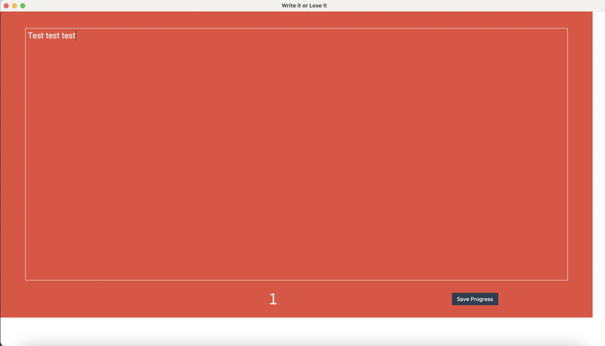
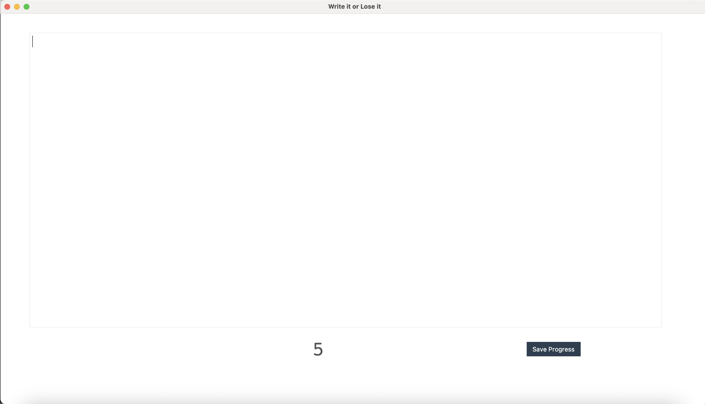

# Writing Helper - Disappearing Text App

A desktop app to get rid of writer's block or to keep you writing. When you stop typing a 5 second timer
starts. If it gets to 0, your text is erased 🙀. App also includes a button to save your progress.


## Usage

To run the app, simply use:

```sh
poetry run python main.py
```

## Screenshots





